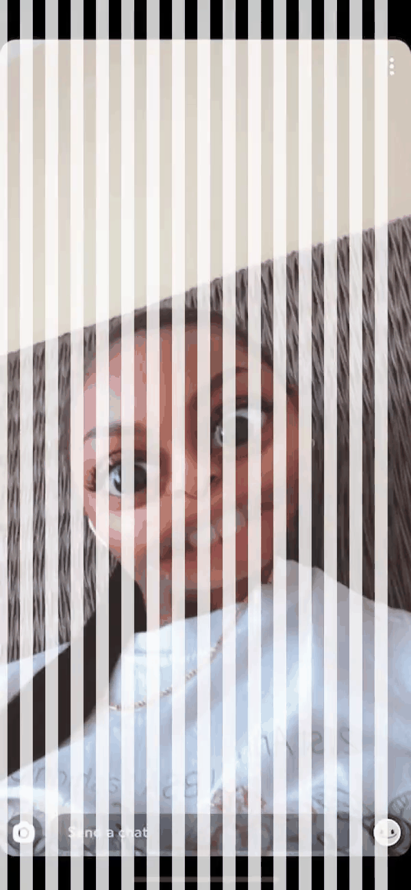

# Barrier Grid Illusion
Barrier Grid Illusion is an animation of lateraly moving lines on top of a static image. When the lines move very quickly, the human eye is able to see the (mostly unobscured) image underneath. However, if a snapshot of the animation is taken, the image is obscured by the lines. D-fence technology patented this idea in 2014. I have re-implemented it here in Python using the Matplotlib and Moviepy modules.

<p align="middle">
  
   
  
</p>

## Repository Contents
- `barrier_grid_illusion.py` is the implementation of the Barrier Grid Illusion over an image
- `attack.ipynb` is a notebook that performs an attack against Barrier Grid Illusion screenshot prevention

## Usage
### 1. Create a virtual environment using Python3 virtualenv
```
cd barrier_grid_illusion

python3 -m venv bgi_env
source bgi_env/bin/activate
pip install --upgrade pip
pip install -r requirements.txt
```

### 2. Generate a Barrier Grid Illusion for an images
While the environment is active, run the python script which starts a Flask server.
```
python barrier_grid_illusion.py
```

While the server is running, issue a GET request of the following form to render a GIF of an image with a barrier grid illusion added. 
```
GET http://127.0.0.1/5000/secure_image?img_path=[path-to-image]
```

A GIF of the illusion will be saved in the same location as the original image. Use `Ctrl-C` to terminate the server and command `deactivate` to close the virtual enviroment.

### 3. Launching an attack
Launch the attack notebook with the environment created in step 1 and run all cells.
```
source bgi_env/bin/activate
python -m pip install ipykernel
ipython kernel install --user --name=bgi_env

jupyter lab attack.ipynb
``` 